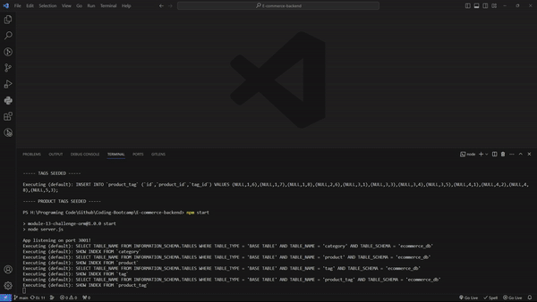
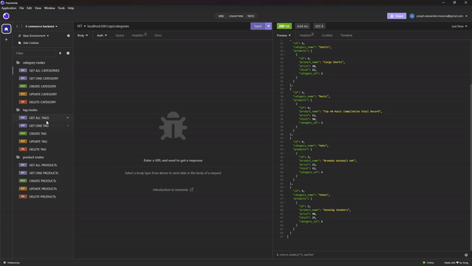
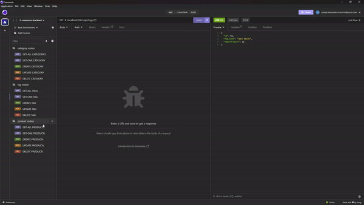

# E-commerce-backend
This is a demonstration of how to make a backend app that handles route requests to a SQL database.

## Description
This project really helped me understand how to properly make model associations using sequelize. One-to-One associations are fairly straight forward, but this project required Many-to-Many interactions. That added in complexity, which was addressed by using the "through" keyword and the "belongsToMany" method. I found it very interesting that "through" would allow sequelize to produce a new model (that I call a 'junction' model like SQL's 'through tables') that facilitates the connectivity of the joined models.  

These model associations also allowed me to practice a new way to implement routes in my api folder. Pulling data from a SQL database can generally be done with a ".findAll" or a ".findByPk()". However, if I wanted to grab data beyond the current table, I needed to call more so the request would trace its way through the SQL tables to collect all the data needed. As it was possible to search for non-existent data, it become very important for me to use try-catch statements to inform the user that they were querying for data that did not exist instead of just crashing the program. 

## Installation
This project requires the following packages to function:
1) "dotenv" which can be found at [https://www.npmjs.com/package/dotenv](https://www.npmjs.com/package/dotenv)
2) "sequelize" which can be found at [https://sequelize.org/docs/v6/](https://sequelize.org/docs/v6/)
3) "express" which can be found at [https://expressjs.com/](https://expressjs.com/) .
4) "mysql2" which can be found at [https://www.npmjs.com/package/mysql2](https://www.npmjs.com/package/mysql2)

The user must also have a .env file with their SQL credentials stored for the program to interact with the SQL database.

## Usage
Once installed, the user needs to start their npm server with the command '''npm start''. Then the user can use Insomnia [https://insomnia.rest/](https://insomnia.rest/) to test the routes in this project. 

The following GIFs show this programs capabilities.
1) Category Routes Demo
 

  
2) Tag Routes Demo 
 

3) Product Routes Demo
 
 
 
A video walkthrough of the proper commands and their output can be found <a href="./assets/E-commerce-backend.mp4"> here</a>.

## License
This product is protected by a [MIT License](http://choosealicense.com/licenses/mit).

## Contributing
This project was built on starter code obtained from [https://github.com/coding-boot-camp/fantastic-umbrella](https://github.com/coding-boot-camp/fantastic-umbrella). I added code to the routes files to handle database requests. I added code to the model files to provide the proper attributes and associations for the SQL tables to be linked properly. 

## Tests
No tests were prepared for this project. Error codes will be displayed by SQL if they occur and erratic behavior can be observed since the output is printed to console.

## Questions
My GitHub username is [ExecutorKarthan](https://github.com/ExecutorKarthan) and this project can be found at [https://github.com/ExecutorKarthan/E-commerce-backend](https://github.com/ExecutorKarthan/E-commerce-backend)

If you have questions or concerns about this project, please email me at me@alexmessina.dev

